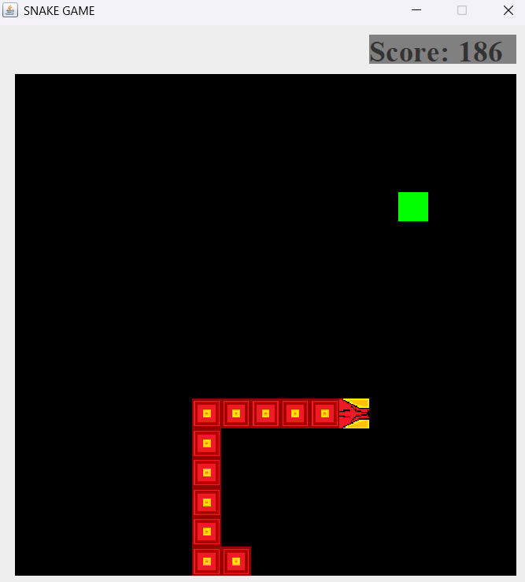

# **🐍 Snake Game (Java)**
Nokia Snake Game, but built using Java. This version was made to test my skills as this is my First mini project in JAVA. It should give you the nostalgic feel of the original.

**Nokia Snake Game**, but built using Java. This version was made to test my skills as this is my First mini project in JAVA. It should give you the nostalgic feel of the original.
## **🎮 Features**

✅ Classic Snake movement and gameplay  
✅ Custom design and visuals  
✅ Score tracking system  
✅ Simple and lightweight

## **🎥 Preview**

## 📷**SCREENSHOT OF THE GAMEPLAY**

## **📜 Controls**

| Key  | Action     |
| ---- | ---------- |
| ⬆️,W | Move Up    |
| ⬇️,S | Move Down  |
| ⬅️,A | Move Left  |
| ➡️,D | Move Right |
## **📜 License**

This project is licensed under the **MIT License**. Feel free to modify and use it!
